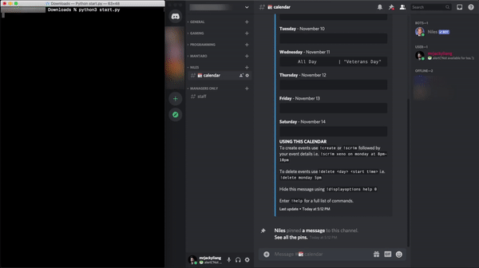

Discord Auto Calendar
======================

A Discord calendar automation script created in Python that allows the end-user to fetch Google Calendar events, and then automatically types it into the [Niles](https://github.com/niles-bot/niles) Discord bot for you.

__In other words, it allows you to combine calendar sources without manual work.__

To use this script, here are the steps you need to follow:

1. Create or login to your [Google](https://cloud.google.com/) account
2. Install [Python 3.8.6](https://www.python.org/downloads/release/python-386/) and [Discord Desktop](https://discord.com/download) on macOS
3. Fill in the variables then run script!

## Retrieve Variables
These are the descriptions of the variables that may be changed depending on your configuration. Examples are located below and inside the script (`start.py`). __If you need help, feel free to [open an issue](https://github.com/mrjackyliang/discord-auto-calendar/issues/new/choose) on GitHub!__

1. `calendarId` - The script will read from this calendar (default is `''`, required)
2. `apiKey` - The API key required to access the Google Calendar API (default is `''`, required)
3. `timeZone` - The time zone in TZ database format (default is `America/New_York`)
4. `timeOffset` - Your UTC time offset in relation to the time zone above (default is `-05:00`)
5. `retina` - Enable High-DPI display or Retina support (default is `True`)

## Installing Packages and Upgrading PIP
Assuming that you have already installed [Python 3.8.6](https://www.python.org/downloads/release/python-386/), we can begin the process by upgrading the `pip` installer and installing the required packages for the script to work properly.

1. Launch a terminal instance ([instructions for macOS](https://support.apple.com/guide/terminal/open-or-quit-terminal-apd5265185d-f365-44cb-8b09-71a064a42125/mac))
2. Type in `python3 -m pip install --upgrade pip` to upgrade to the latest Python PIP installer
3. Type in `pip3 install pyautogui Pillow opencv_python` to install dependencies

__NOTE:__ You must additionally run the `Install Certificates.command` file located under `/Applications/Python 3.8/` for SSL support.

## Get the Google Calendar ID
For the script to work, a public Google Calendar source is required. This will allow the script to remotely access and retrieve future events data for this calendar.

1. Go to the [Google Calendar](https://calendar.google.com/calendar/)'s website
2. Under the left sidebar, hover and click "__⋮__" on the calendar you want to use
3. Then click __Settings__
4. Under the __Integrate calendar__ section, copy the __Calendar ID__
5. Paste this into the `calendarId` variable inside the script

## Get the Google API Key
As with all Google-related data requests, an API key is required for the script to communicate and retrieve calendar data. The Google Calendar API is free for use (requires a credit/debit card) and comes with a [generous 1,000,000 queries per day](https://developers.google.com/calendar/pricing).

##### Set up Billing Account

1. Create a new [Google Cloud Billing Account](https://console.cloud.google.com/billing/create)
2. Specify a __Name__ and a __Country__, then click __Continue__
3. Under __Payments profile__, click __Create payments profile__ or select an existing profile
4. Review or fill in the information, then click __SUBMIT AND ENABLE BILLING__

##### Set up API key

1. Create a new [Google Cloud Project](https://console.cloud.google.com/projectcreate)
2. For the __Project name__, type in "Calendar" (without quotes), then click __Create__
3. Go to [Google Calendar APIs & Services](https://console.cloud.google.com/apis/library/calendar-json.googleapis.com) website
4. Click the blue __ENABLE__ button, then select __Calendar__
5. Once the page refreshes, go to the [APIs & Services Credentials](https://console.cloud.google.com/apis/credentials) website
6. Click __CREATE CREDENTIALS__, then select __API key__
7. Click __RESTRICT KEY__
8. Under the __API restrictions__ section, click __Restrict key__
9. Under the __Select APIs__ menu, select __Google Calendar API__
10. Then click __SAVE__
11. Under the __API Keys__ section, copy the API key in the __Key__ column
12. Paste this into the `apiKey` variable inside the script

## Get the Time Zone Information
In order to retrieve correct calendar data, a time zone and its UTC offset must be defined. It will allow the script to correctly omit past events and convert the event time zones ready for use with the bot.

1. Visit the [Free Time Zone Database](https://timezonedb.com) website
2. Find and click the __Get my current latitude and longitude__ link
3. Click __GET TIME ZONE__
4. Right of the __Zone Name__ row, fill in the `timeZone` variable based on the example below:
   - In New York, it would be `America/New_York`
   - In Shanghai, it would be `Asia/Shanghai`
5. Right of the __GMT Offset__ row, fill in the `timeOffset` variable based on the example below:
   - `UTC/GMT -5.00 hours` would be `-05:00`
   - `UTC/GMT +8.00 hours` would be `+08:00`

__NOTE:__ If you are setting a calendar for a different time zone, you must manually find the latitude/longitude information for that time zone and skip Step 2.

## Configure High-DPI support
Because of indifferent screen resolutions, the `pyautogui` library is not able to determine if you are using a High-DPI display or as Apple calls it, a Retina display. For this, the script will include a variable to help `pyautogui` correctly position the text box for typing.

The default is `True`. Configure `retina` with the values below:
- Set `retina` to `True` for Retina display support
- Set `retina` to `False` for Non-Retina display support

## Run the script
Finally after getting everything up and running, it is time to put the automation to the test!

1. Open Discord and [Terminal](https://support.apple.com/guide/terminal/open-or-quit-terminal-apd5265185d-f365-44cb-8b09-71a064a42125/mac) in one space and align both applications side-by-side for ease of use (like the GIF shown above). Then configure both apps below:
   - In Discord, make sure you have the `📆calendar` channel open. If it does not exist, create it and set up the [Niles](https://github.com/niles-bot/niles) bot.
   - In Terminal, change the directory to `cd ~/Downloads/discord-auto-calendar`. This command assumes the file is downloaded and extracted into the Downloads folder.
2. When you're ready, launch the script by typing in `python3 start.py` into the Terminal

__NOTE:__ If you use multiple monitors, please note that the script will only recognize the primary monitor. Learn more about creating new spaces [using Mission Control on your Mac](https://support.apple.com/en-us/HT204100)!
